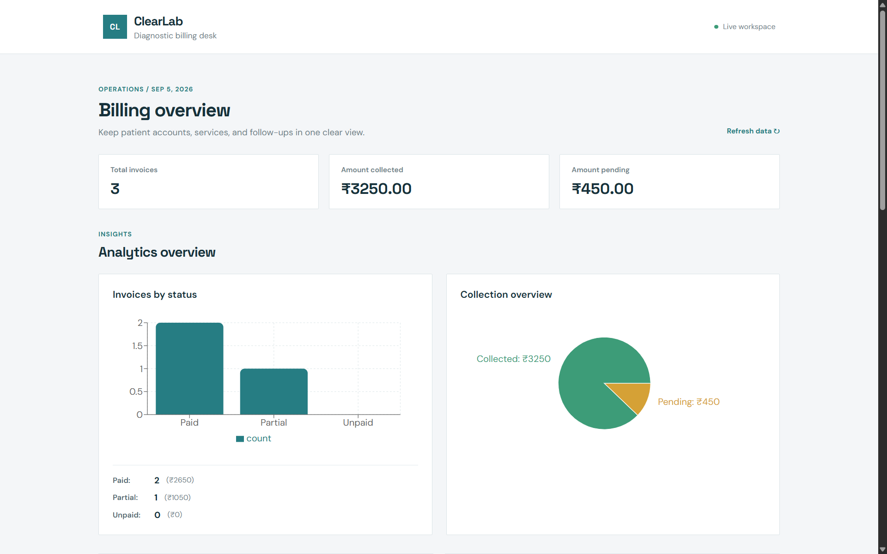
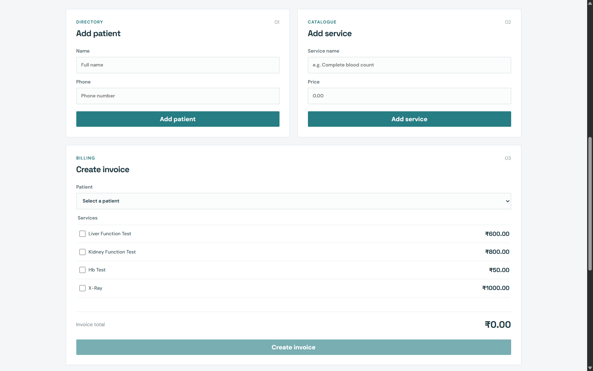
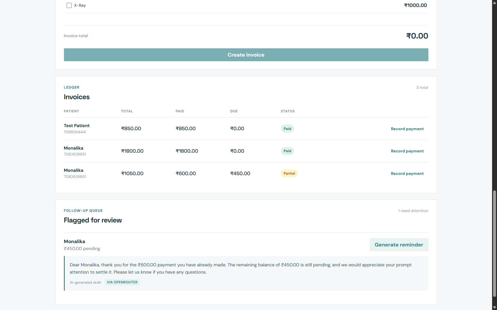

# ClearLab — AI-Assisted Billing Assistant for Diagnostic Labs

ClearLab helps small diagnostic labs manage patient billing without losing track of unpaid or partially-paid invoices. It automates invoice creation from a fixed service list, tracks payment status in real time, and uses AI to draft context-aware payment reminder messages — while knowing when to defer to a human instead of guessing.

## Problem

Small diagnostic labs often lose revenue simply because payment follow-ups are manual, inconsistent, or forgotten. ClearLab automates the routine cases (a reminder for an unpaid invoice) while flagging genuinely ambiguous ones (a partial payment) for staff review, rather than acting on uncertain information.

## Screenshots

## Features

- Patient and service management
- Invoice generation from a fixed, priced service list
- Real-time payment tracking with status (unpaid / partial / paid)
- AI-drafted payment reminders with tone that adapts to context (first reminder, follow-up, or partial-payment acknowledgment)
- Automatic flagging of partial payments for human review, kept separate from routine unpaid reminders
- AI provider fallback: OpenRouter (primary) → Gemini (backup), with timeouts on both
- Overpayment prevention at the API level
- Dashboard summary: total invoices, amount collected, amount pending

## Tech Stack

- **Frontend:** React, built and served with Vite; plain CSS
- **Backend:** Node.js, Express
- **Database:** MongoDB (Atlas)
- **AI:** OpenRouter (primary) with Gemini API as fallback

## Architecture Notes

Invoices store a *snapshot* of each service's name and price at the time of billing, so later price changes never alter historical invoices. AI reminder generation is isolated in its own service module (`aiService.js`) so the provider (or fallback chain) can be swapped without touching controller logic. The reminder route only commits changes to the database (incrementing reminder count, saving the draft) after confirming the AI response is genuinely valid — a failed or empty response returns a clean error instead of silently corrupting invoice state.

## Getting Started

### Backend
\`\`\`
cd backend
npm install
\`\`\`

Create a `.env` file in `backend/` with:
\`\`\`
MONGO_URI=your_mongodb_connection_string
OPENROUTER_API_KEY=your_key
GEMINI_API_KEY=your_key
PORT=5000
\`\`\`

\`\`\`
npm run dev
\`\`\`

### Frontend
\`\`\`
cd frontend
npm install
npm run dev
\`\`\`

## Known Limitations

- Reminders are drafted on-screen only; sending via SMS/WhatsApp is a manual step (no messaging API integrated in this version)
- Currently uses OpenRouter's free auto-router, which can occasionally route to a lower-quality model; pinning a single tested model is a planned improvement